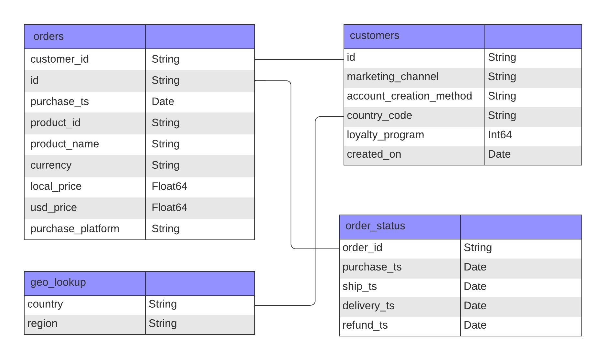

# elist_data_analysis
A sales trend data analysis for an e-commerice company. 

# Overview

## ERD


```sql
+-------------------------------------------------------------------+
| ORDERS                                                            |
+-------------------------------------------------------------------+
| customer_id                                           | STRING    |
| id                                                    | STRING    | 
| purchase_ts                                           | DATE      | 
| product_id                                            | STRING    |
| product_name                                          | STRING    |
| currency                                              | STRING    |
| local_price                                           | FLOAT64   |
| usd_price                                             | FLOAT64   |
| purchase_platform                                     | STRING    |
+--------------------------------------------+----------------------+

+-------------------------------------------------------------------+
| GEO_LOOKUP                                                        |
+-------------------------------------------------------------------+
| country                                               | STRING    |
| region                                                | STRING    | 
+--------------------------------------------+----------------------+

+-------------------------------------------------------------------+
| CUSTOMERS                                                         |
+-------------------------------------------------------------------+
| id                                                    | STRING    |
| marketing_channel                                     | STRING    |
| account_creation_platform                             | STRING    |
| country_code                                          | STRING    | 
| loyalty_program                                       | INT64     | 
| created_on                                            | DATE      |
+--------------------------------------------+----------------------+

+-------------------------------------------------------------------+
| ORDER_STATUS                                                      |              
+-------------------------------------------------------------------+
| order_id                                              | STRING    |
| purchase_ts                                           | DATE      |
| ship_ts                                               | DATE      |
| delivery_ts                                           | DATE      |
| refund_ts                                             | DATE      |
+--------------------------------------------+----------------------+
```

# Insights
section text

## Sales Trends
section text


## Product Trends
section text


## Loyalty Program
section text


## Refund Rates
section text

